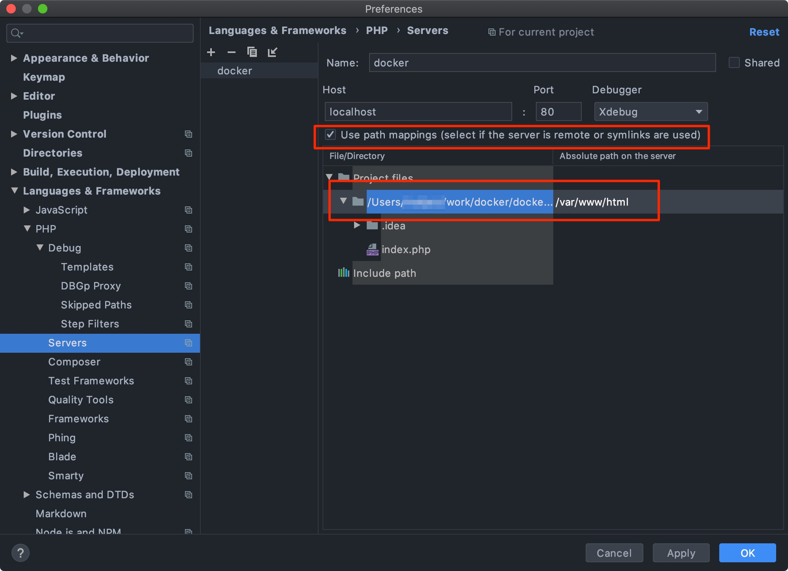
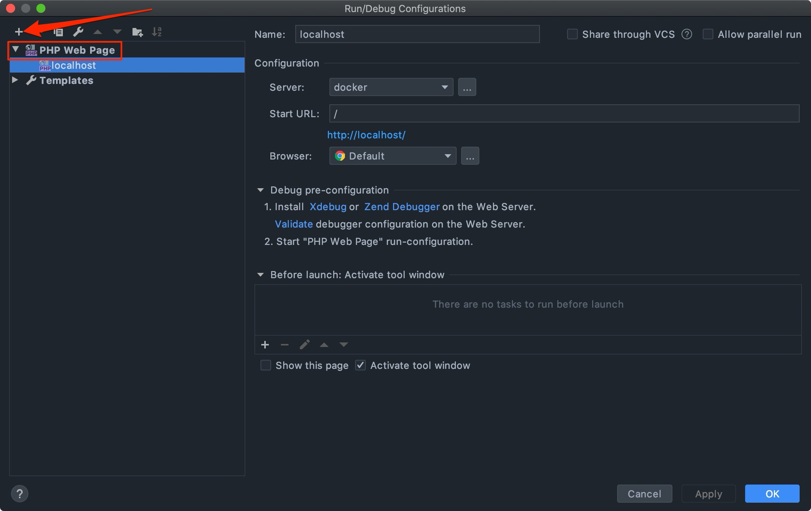
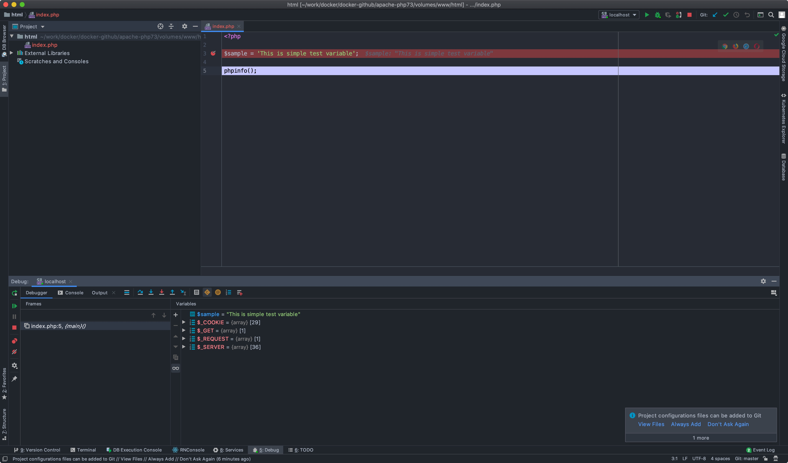

# Setting optional environment variables in docker-compose.yml

For the full list check [start.sh](./php/start.sh)

```
environment:
      - PHP_XDEBUG_ENABLED=true
      # change the line below with your HOST IP address
      - PHP_XDEBUG_REMOTE_HOST=192.168.1.2
      - PHP_XDEBUG_REMOTE_PORT=9000
      - PHP_SHORT_OPEN_TAG=On
      - PHP_UPLOAD_MAX_FILESIZE=20M
```

# Running sample using docker-compose.yml

```docker-compose up -d```

# How to use XDEBUG with Docker container with PhpStorm

#### 1. Edit ```docker-compose.yml``` where you set host IP address

```yaml
services:
  www:
    .
      # change the line below with your HOST IP address
      - PHP_XDEBUG_REMOTE_HOST=192.168.1.2
    .
```
#### 2. Run ```docker-compose up -d```
Make sure XDEBUG is loaded (use ```phpinfo```). If not, check file ```50-xdebug.ini```

phpinfo output:
```
xdebug.remote_host	192.168.1.2	192.168.1.2
```

#### 3. Add new PHP server


#### 4. Edit Run/Debug configurations


#### 5. Set a breakpoint and RUN debug


